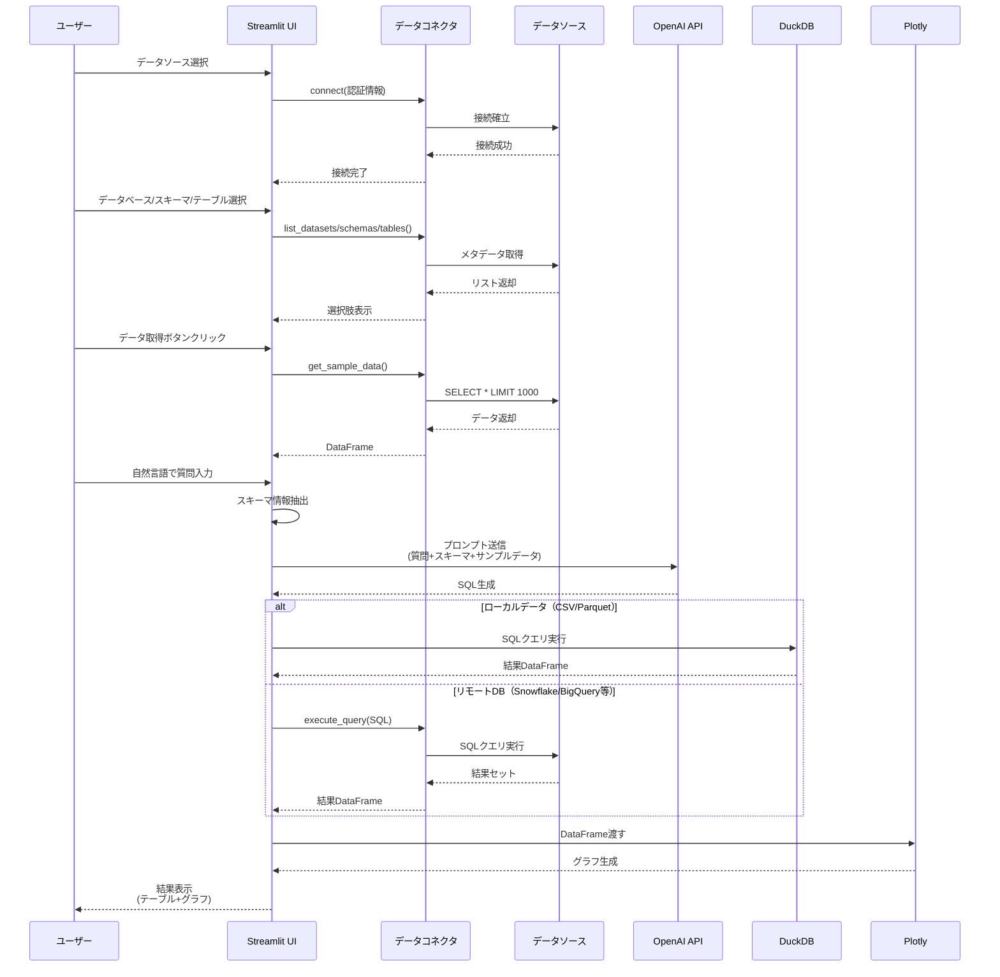
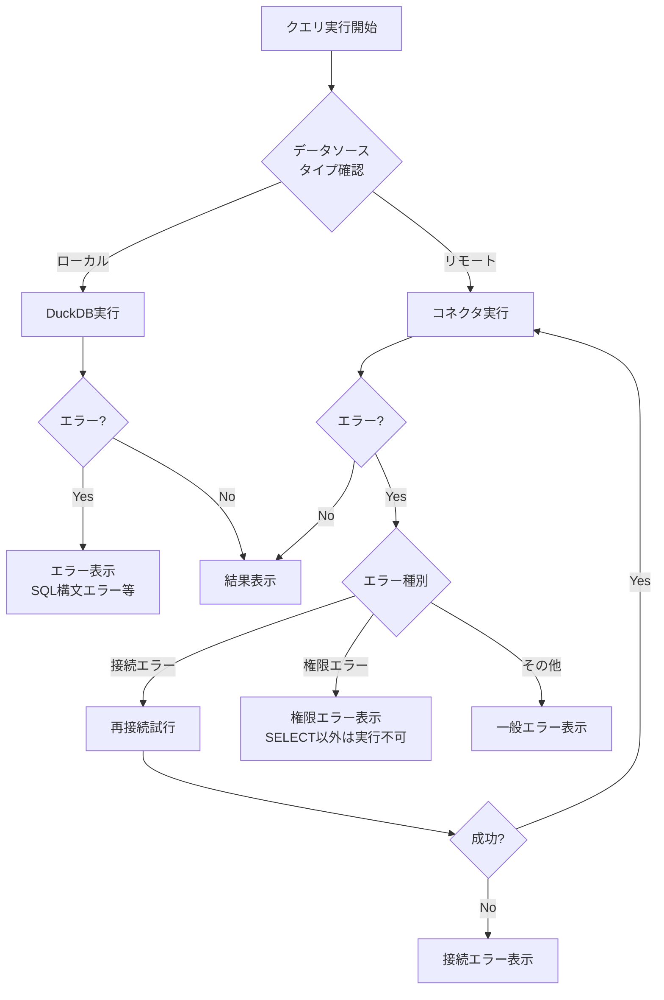
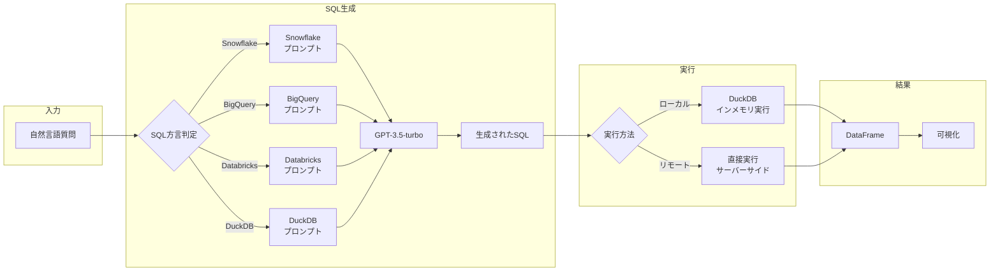

# データフロー図

## Text2SQL実行フロー

```mermaid
sequenceDiagram
    participant User as ユーザー
    participant UI as Streamlit UI
    participant Connector as データコネクタ
    participant DB as データソース
    participant OpenAI as OpenAI API
    participant DuckDB as DuckDB
    participant Viz as Plotly

    User->>UI: データソース選択
    UI->>Connector: connect(認証情報)
    Connector->>DB: 接続確立
    DB-->>Connector: 接続成功
    Connector-->>UI: 接続完了

    User->>UI: データベース/スキーマ/テーブル選択
    UI->>Connector: list_datasets/schemas/tables()
    Connector->>DB: メタデータ取得
    DB-->>Connector: リスト返却
    Connector-->>UI: 選択肢表示

    User->>UI: データ取得ボタンクリック
    UI->>Connector: get_sample_data()
    Connector->>DB: SELECT * LIMIT 1000
    DB-->>Connector: データ返却
    Connector-->>UI: DataFrame

    User->>UI: 自然言語で質問入力
    UI->>UI: スキーマ情報抽出
    UI->>OpenAI: プロンプト送信<br/>(質問+スキーマ+サンプルデータ)
    OpenAI-->>UI: SQL生成

    alt ローカルデータ（CSV/Parquet）
        UI->>DuckDB: SQLクエリ実行
        DuckDB-->>UI: 結果DataFrame
    else リモートDB（Snowflake/BigQuery等）
        UI->>Connector: execute_query(SQL)
        Connector->>DB: SQLクエリ実行
        DB-->>Connector: 結果セット
        Connector-->>UI: 結果DataFrame
    end

    UI->>Viz: DataFrame渡す
    Viz-->>UI: グラフ生成
    UI-->>User: 結果表示<br/>(テーブル+グラフ)
```

## エラーハンドリングフロー

```mermaid
flowchart TD
    Start[クエリ実行開始] --> Check{データソース<br/>タイプ確認}
    
    Check -->|ローカル| LocalExec[DuckDB実行]
    Check -->|リモート| RemoteExec[コネクタ実行]
    
    LocalExec --> LocalError{エラー?}
    RemoteExec --> RemoteError{エラー?}
    
    LocalError -->|Yes| ShowLocalError[エラー表示<br/>SQL構文エラー等]
    LocalError -->|No| Success[結果表示]
    
    RemoteError -->|Yes| ErrorType{エラー種別}
    RemoteError -->|No| Success
    
    ErrorType -->|接続エラー| Reconnect[再接続試行]
    ErrorType -->|権限エラー| ShowPermError[権限エラー表示<br/>SELECT以外は実行不可]
    ErrorType -->|その他| ShowGenericError[一般エラー表示]
    
    Reconnect --> RetryCheck{成功?}
    RetryCheck -->|Yes| RemoteExec
    RetryCheck -->|No| ShowConnError[接続エラー表示]
```

## データソース別の処理フロー

```mermaid
graph LR
    subgraph "入力"
        NL[自然言語質問]
    end

    subgraph "SQL生成"
        NL --> Dialect{SQL方言判定}
        Dialect -->|Snowflake| SnowflakePrompt[Snowflake<br/>プロンプト]
        Dialect -->|BigQuery| BigQueryPrompt[BigQuery<br/>プロンプト]
        Dialect -->|Databricks| DatabricksPrompt[Databricks<br/>プロンプト]
        Dialect -->|DuckDB| DuckDBPrompt[DuckDB<br/>プロンプト]
        
        SnowflakePrompt --> GPT[GPT-3.5-turbo]
        BigQueryPrompt --> GPT
        DatabricksPrompt --> GPT
        DuckDBPrompt --> GPT
        
        GPT --> SQL[生成されたSQL]
    end

    subgraph "実行"
        SQL --> ExecType{実行方法}
        ExecType -->|ローカル| DuckExec[DuckDB<br/>インメモリ実行]
        ExecType -->|リモート| DirectExec[直接実行<br/>サーバーサイド]
    end

    subgraph "結果"
        DuckExec --> Result[DataFrame]
        DirectExec --> Result
        Result --> Viz[可視化]
    end
```