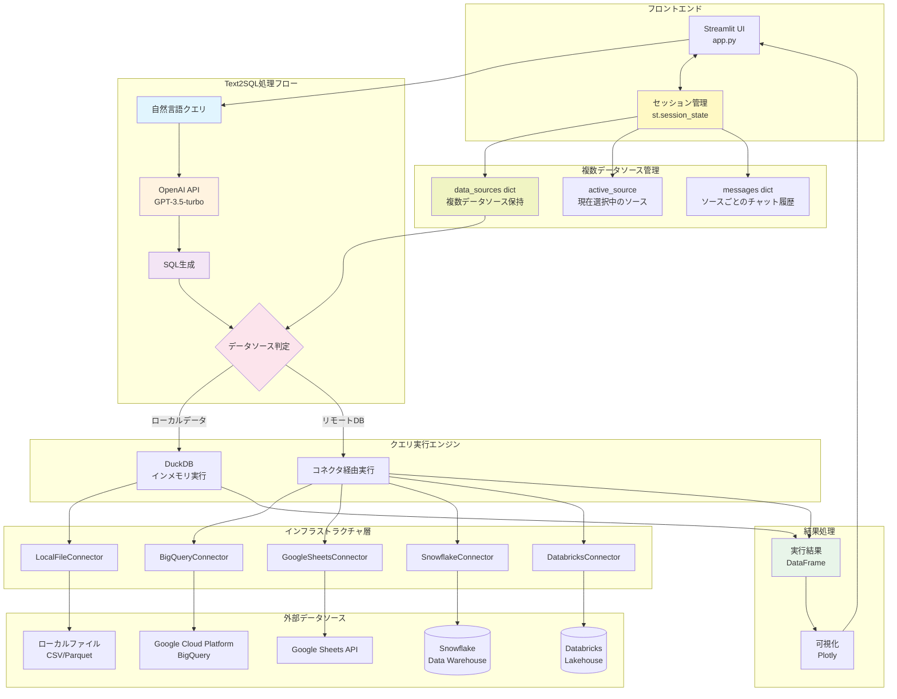
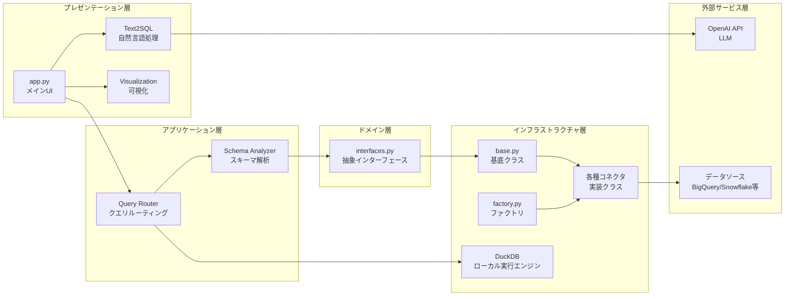
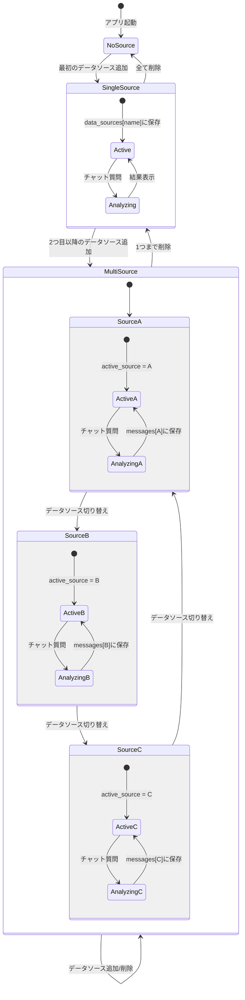

# Vizzy システムアーキテクチャ

## 概要
Vizzyは、レイヤードアーキテクチャ（DDD風）を採用したStreamlitベースのWebアプリケーションです。

## システム全体図



## レイヤー構成



## コネクタクラス図


## セッション状態管理

複数データソースの同時接続を実現するため、以下のセッション状態を管理しています。



### データ構造

```python
# セッション状態の構造
st.session_state = {
    # 複数データソースを名前をキーとして管理
    'data_sources': {
        '売上データ2024': {
            'type': 'snowflake',
            'df': DataFrame,
            'connector': SnowflakeConnector,
            'database': 'PROD_DB',
            'schema': 'SALES',
            'table': 'ORDERS'
        },
        'マーケティングデータ': {
            'type': 'bigquery',
            'df': DataFrame,
            'connector': BigQueryConnector,
            'project': 'my-project',
            'dataset': 'marketing',
            'table': 'campaigns'
        },
        'ローカル分析用CSV': {
            'type': 'local',
            'df': DataFrame,
            'connector': None,
            'file_name': 'analysis.csv'
        }
    },

    # 現在表示中のデータソース名
    'active_source': '売上データ2024',

    # データソースごとの独立したチャット履歴
    'messages': {
        '売上データ2024': [
            {'role': 'user', 'content': '月別の売上を見せて'},
            {'role': 'assistant', 'content': '...', 'sql': '...', 'result_df': ...}
        ],
        'マーケティングデータ': [
            {'role': 'user', 'content': 'キャンペーン効果を分析'},
            {'role': 'assistant', 'content': '...', 'sql': '...', 'result_df': ...}
        ],
        'ローカル分析用CSV': []
    }
}
```

## 主要な特徴

1. **複数データソース同時接続**:
   - 複数のデータソースを同時に接続・管理
   - シームレスなデータソース切り替え
   - データソースごとに独立したチャット履歴
   - 直感的なUI（サイドバー）でデータソースを管理

2. **Text2SQL統合アーキテクチャ**:
   - 自然言語→OpenAI API→SQL生成→実行の一貫したフロー
   - データソースに応じた最適なSQL方言の生成（Snowflake、BigQuery、Databricks、DuckDB）
   - カラム名の大文字・小文字やクォーテーションルールを自動判定

3. **マルチデータソース対応**:
   - BigQuery、Snowflake、Databricks、Google Sheets、ローカルファイル
   - 統一インターフェースで操作方法を覚え直す必要なし
   - データソースごとに最適化されたSQL生成

4. **アダプティブ実行エンジン**:
   - ローカルデータ: DuckDB (インメモリ高速処理)
   - リモートDB: 各コネクタ経由でサーバーサイド実行
   - データの所在に応じた最適な実行戦略

5. **読み取り専用安全設計**:
   - SELECT文のみ実行可能
   - データの誤変更・削除リスクを完全排除

6. **インテリジェント可視化**:
   - AIがデータとクエリ結果から最適なグラフタイプを推定
   - Plotlyによるインタラクティブな可視化

7. **独立したコンテキスト管理**:
   - データソースごとに独立したチャット履歴
   - データソースを切り替えても過去の分析履歴を維持
   - 複数のデータソースで並行して分析作業が可能