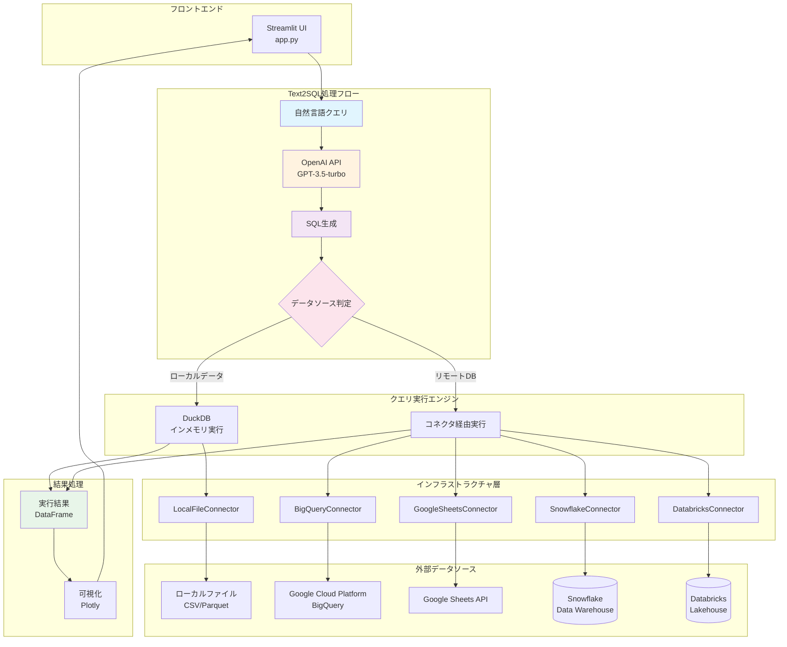
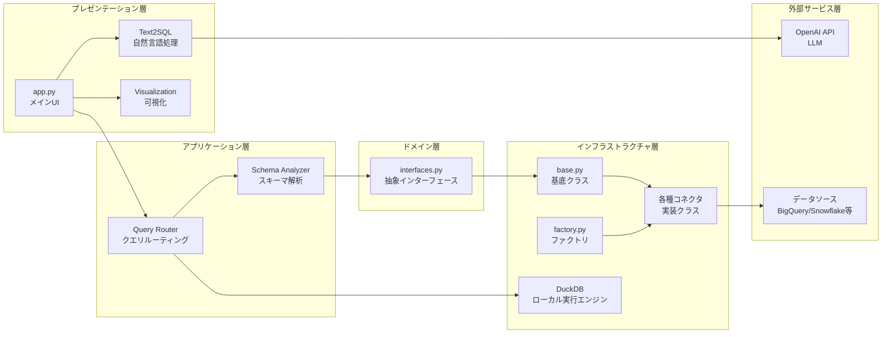
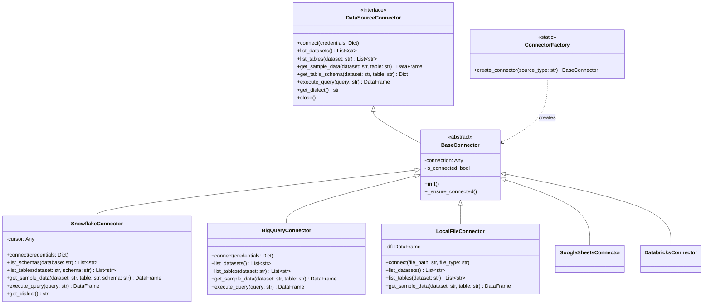

# Vizzy システムアーキテクチャ

## 概要
Vizzyは、レイヤードアーキテクチャ（DDD風）を採用したStreamlitベースのWebアプリケーションです。

## システム全体図

## レイヤー構成

## コネクタクラス図

## 主要な特徴

1. **Text2SQL統合アーキテクチャ**: 
   - 自然言語→OpenAI API→SQL生成→実行の一貫したフロー
   - データソースに応じた最適なSQL方言の生成

2. **マルチデータソース対応**: 
   - BigQuery、Snowflake、Databricks、Google Sheets、ローカルファイル
   - 統一インターフェースで操作方法を覚え直す必要なし

3. **アダプティブ実行エンジン**: 
   - ローカルデータ: DuckDB (インメモリ高速処理)
   - リモートDB: 各コネクタ経由でサーバーサイド実行
   - データの所在に応じた最適な実行戦略

4. **読み取り専用安全設計**: 
   - SELECT文のみ実行可能
   - データの誤変更・削除リスクを完全排除

5. **インテリジェント可視化**:
   - AIがデータとクエリ結果から最適なグラフタイプを推定
   - Plotlyによるインタラクティブな可視化