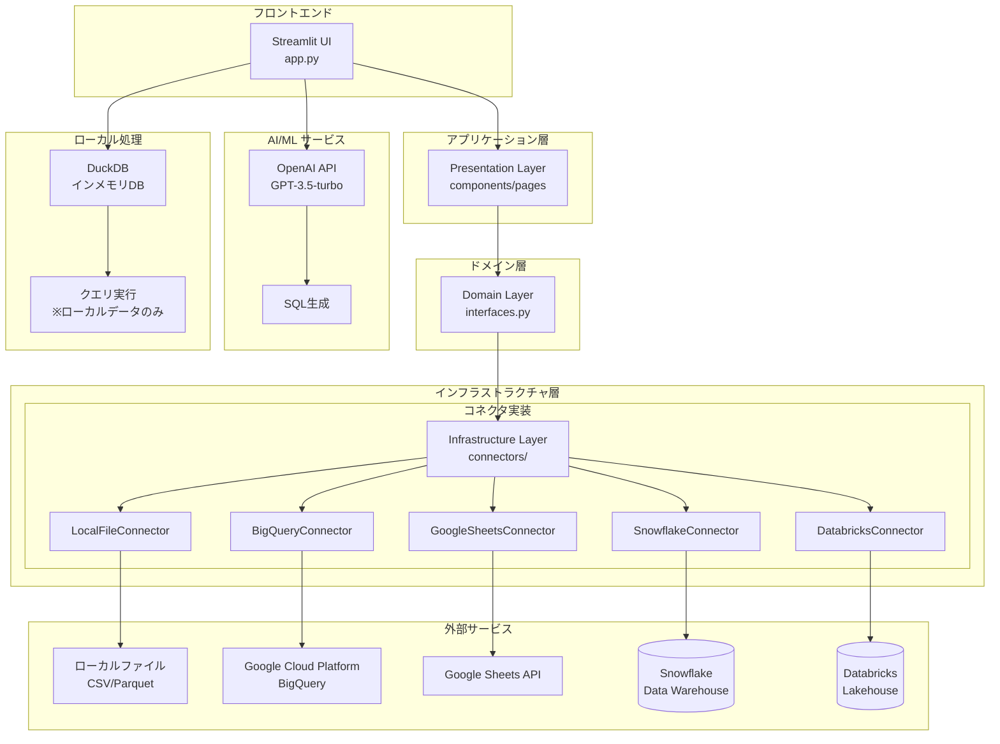
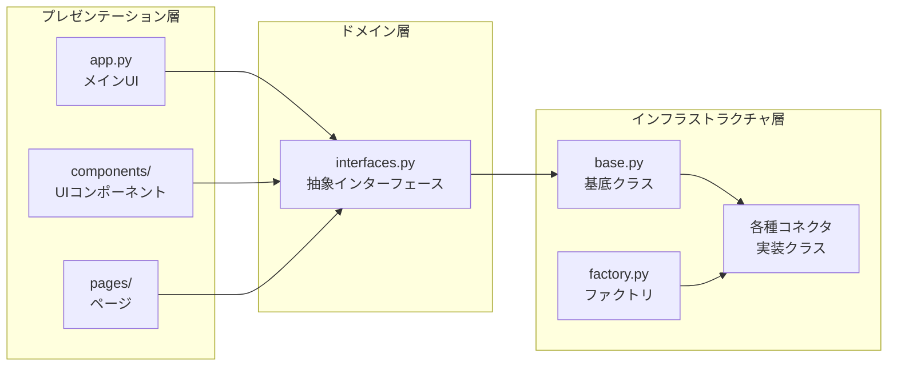

# Vizzy システムアーキテクチャ

## 概要
Vizzyは、レイヤードアーキテクチャ（DDD風）を採用したStreamlitベースのWebアプリケーションです。

## システム全体図

## レイヤー構成

## コネクタクラス図

## 主要な特徴

1. **読み取り専用設計**: SELECT文のみ実行可能で、データの変更リスクなし
2. **マルチデータソース対応**: 統一インターフェースで複数のデータソースに対応
3. **AI駆動**: OpenAI APIを使用した自然言語→SQL変換
4. **アダプティブ実行**: データソースに応じて最適な実行方法を選択
   - ローカルデータ: DuckDB (インメモリ処理)
   - リモートDB: 直接SQL実行 (サーバーサイド処理)